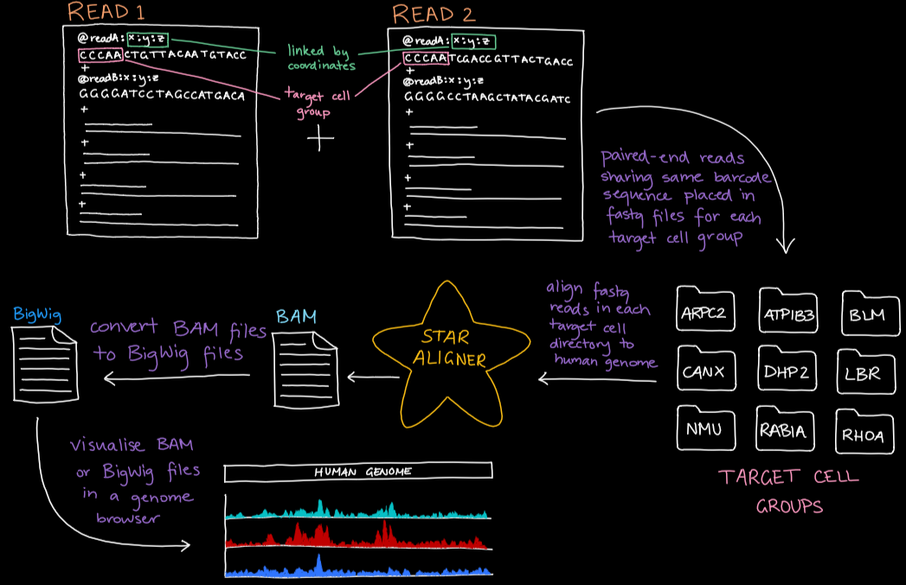

# TECHNICAL DOCUMENTATION

# Installation 

Install the pipeline using the following command
```
git clone https://github.com/cactusjuic3/teamvoineagu
```

### Prerequisites 

* Linux OS
* [Python3](https://www.python.org/downloads/)
* [Star Aligner v2.5.2b](https://physiology.med.cornell.edu/faculty/skrabanek/lab/angsd/lecture_notes/STARmanual.pdf)
* [Deeptools](https://deeptools.readthedocs.io/en/develop/content/installation.html) (bamCoverage) 
* [Samtools](http://www.htslib.org/) 


### master_script.sh setup 
Change the following program paths in master_script.sh to the actual program path on your system (lines 27, 28, 29):
* STAR_RUN
* BAMCOVERAGE_RUN
* SAMTOOLS_RUN

## Versioning

For the versions available, see the [tags on this repository](https://github.com/cactusjuic3/teamvoineagu/tags). 

# Pipeline Workflow Diagram


# Pipeline Components
All scripts have thorough documentation amongst the code. Below is a summary of the function of each script, dive into the code for specifics of implemenation!

### master_script.sh
- Copies fastq files from data directory and decompresses them in the working directory
- For each lane of read one, run parse_lane.py
- Once all lanes have been run, align the fastqs with star aligner in one run for each library index with genome_align.sh
- If necessary convert BAM files to BigWig with bam_to_bigwig.sh
- Remove temporary and intermediary files, tidy output directory with tidy_files.sh

### parse_lane.py 
- Create dictionary of form dictionary[16bp_barcode] = x:y:z by iterating through read one fastqs: output is dictionary
- Iterate through corresponding read two fastq, if coordinates exist in dictionary, assign the read to its target group and write reads out separated by their library index: output is one directory for every group with 4 fastqs inside, one for each
- For datasets with fastqs greater than 100 million lines, threading will be enabled to increase performance of pipeline

### genome_align.sh 
- Align fastq files in each cell target group to human genome using STAR aligner: output is BAM file.
- The user is free to add, remove or adjust parameters in the STAR aligner command to suit their needs - please refer to the [STAR Aligner docs](https://physiology.med.cornell.edu/faculty/skrabanek/lab/angsd/lecture_notes/STARmanual.pdf) to see the available options.
- Given a list of distinct adaptor sequences (library barcodes) perform a STAR alignment for each one.
    - Each target cell group directory has a fastq file corresponding to each of the library barcode sequences.
    - Perform a STAR alignment for each barcode sequence, by passing in multiple fastq files across all target cell group that correspond to the respective barcode sequence.
- The STAR alignment generates one BAM file for the barcode sequence which includes reads from all target cell groups.
- For each BAM file generated from STAR Aligner, it is split into smaller BAM files by target cell groups.
- After all barcode sequence BAM files have been split, merge the BAM files into one larger BAM file based on their target cell group. 
- For each target cell group BAM file an index file (.bai) is generated to assist with visualisation.

### bam_to_bigwig.sh 
- Convert a BAM file to a BigWig file using bamCoverage from deepTools
- The user is free to add, remove or adjust parameters in the bamCoverage command to suit their needs - please refer to the [bamCoverage docs](https://deeptools.readthedocs.io/en/develop/content/tools/bamCoverage.html) to see the available options.
- The user can change different parameters in BamCoverage to allow for read coverage normalization and read processing options.

### tidy_files.sh 
- Deletes unwanted file formats and moves all output files to ${working_dir}/SORTED_GROUPS for easy visualisation

## Expert Functionality 
- Read ones with erroneous indices will have their header printed to a fastq.error
- Percentage of these erroneous indices is printed in the log per lane
- You may identify these indices and incoporate them in another run
    - Go through read one fastq.error, grab [NNNNNN]
    - Add these indices into the indices list
    - Specify only bam output and rerun pipeline
    - At conclusion of run:
        - combine desired bam files together with samtools
        - convert bams to bigwig with ./bam_to_bigwig.sh
```
rna:check_master_script student$ head *error
==> 2000_PilotCROP_C_1_S1_L002_R1_001.fastq.error <==
@A00152:202:HJN5KDRXX:2:1101:27082:1016 1:N:0:CACTGGAG
@A00152:202:HJN5KDRXX:2:1101:27534:1016 1:N:0:TCCCTCCT
@A00152:202:HJN5KDRXX:2:1101:28782:1016 1:N:0:AGGAATTA
@A00152:202:HJN5KDRXX:2:1101:28908:1016 1:N:0:TCCCTCCT
@A00152:202:HJN5KDRXX:2:1101:31982:1016 1:N:0:ACCCTCCA
@A00152:202:HJN5KDRXX:2:1101:22083:1031 1:N:0:TCCCTCCT
```


# Authors 

* **Chelsea Liang** - *Part A* - [LinkedIn](https://www.linkedin.com/in/chelsea-liang-03674b140/)
* **David Nguyen** - *Part A* - [Github](https://github.com/davenyen), [LinkedIn](https://www.linkedin.com/in/david-nguyen-6003231a0/)
* **Caitlyn Ramsay** - *Part B* - [LinkedIn](https://www.linkedin.com/in/caitlin-ramsay-7776251a4/)
* **Michal Sernero** - *Part B* - [Github](https://github.com/MichalSernero)
* **Sehhaj Grewal** - *Part B* - [LinkedIn](https://www.linkedin.com/in/sehhajgrewal/)

## License

This project is not licensed. 

## Acknowledgments 

* Irina Voineagu 
* Gavin Sutton
* Voineagu Lab
* Pydocs
* Stackoverflow
* Alex Dobin - STAR 
* Deeptools (BamCoverage)
* Samtools

